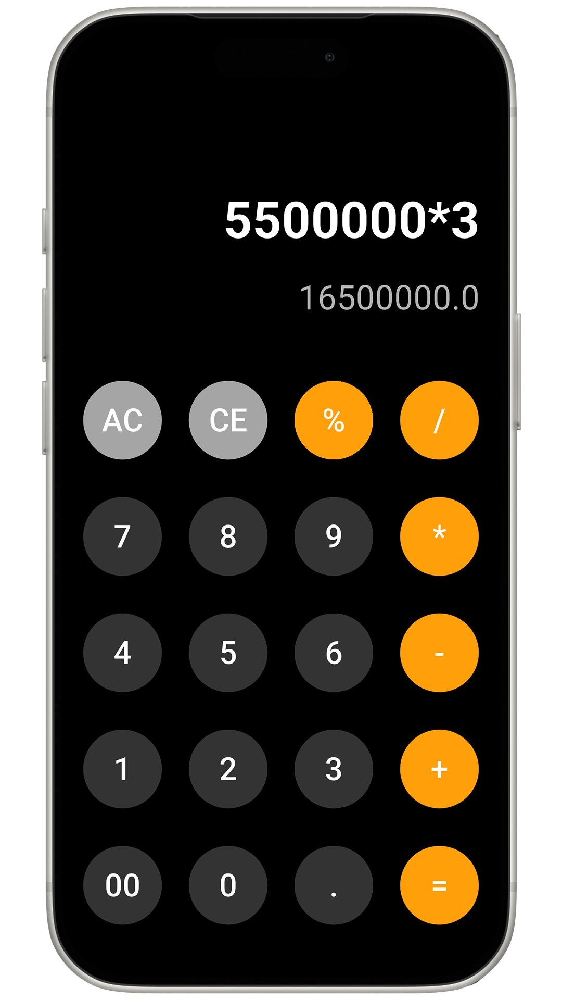

<<<<<<< HEAD
# calculator_app

A new Flutter project.

## Getting Started

This project is a starting point for a Flutter application.

A few resources to get you started if this is your first Flutter project:

- [Lab: Write your first Flutter app](https://docs.flutter.dev/get-started/codelab)
- [Cookbook: Useful Flutter samples](https://docs.flutter.dev/cookbook)

For help getting started with Flutter development, view the
[online documentation](https://docs.flutter.dev/), which offers tutorials,
samples, guidance on mobile development, and a full API reference.
=======
# Calculator App

A simple iOS-style calculator built with Flutter as one of my early projects.

## Features
- Basic arithmetic: `+` `-` `*` `/` `%`
- Backspace and full reset
- Clean dark UI

## Getting Started
```bash
flutter pub get
flutter run
```

## Dependencies
- [math_expressions](https://pub.dev/packages/math_expressions)

## Preview

